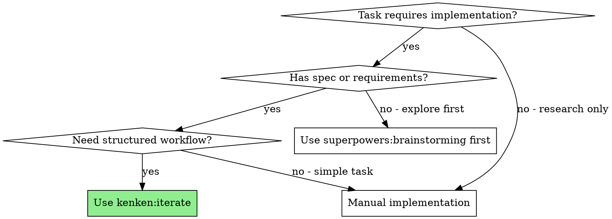

# kenken Iterate Workflow

> **For Claude:** This skill orchestrates development through 4 stages. Follow each stage sequentially. Do not skip phases.

## When to Use



## Overview

**Stages:** PLAN → IMPLEMENT → TEST (optional) → FINAL

```dot
digraph workflow {
    rankdir=LR;

    subgraph cluster_plan {
        label="PLAN";
        "1.1 Brainstorm" -> "1.2 Write Plan" -> "1.3 Plan Review";
    }

    subgraph cluster_implement {
        label="IMPLEMENT";
        "2.1 Implementation" -> "2.2 Code Simplify" -> "2.3 Implement Review";
    }

    subgraph cluster_test {
        label="TEST (optional)";
        "3.1 Test Plan" -> "3.2 Write Tests" -> "3.3 Coverage" -> "3.4 Run Tests" -> "3.5 Test Review";
    }

    subgraph cluster_final {
        label="FINAL";
        "4.1 Codex Final" -> "4.2 Suggest Extensions";
    }

    "1.3 Plan Review" -> "2.1 Implementation";
    "2.3 Implement Review" -> "3.1 Test Plan" [label="if enabled"];
    "2.3 Implement Review" -> "4.1 Codex Final" [label="if disabled"];
    "3.5 Test Review" -> "4.1 Codex Final";
    "4.2 Suggest Extensions" -> "1.1 Brainstorm" [label="user accepts" style=dashed];
}
```



**State file:** `.agents/kenken-state.json`

**Config file:** `.claude/kenken-config.json`

## Initialization

1. Load configuration (see Configuration section)
2. Create or read state file
3. If resuming, continue from saved phase
4. If new, start at Phase 1.1

## Stage 1: PLAN

Complete all phases before advancing to IMPLEMENT.

### Phase 1.1: Brainstorm

**Goal:** Understand the problem and design a solution.

**Skill:** `superpowers:brainstorming` + `superpowers:dispatching-parallel-agents`

**Actions:**

1. Read existing code to understand context
2. Dispatch parallel agents to research:
   - Existing patterns in codebase
   - Requirements and constraints
   - Edge cases
3. Ask clarifying questions (one at a time)
4. Propose 2-3 approaches with trade-offs
5. Get user agreement on approach
6. Save design to `docs/plans/{date}-{topic}-design.md`

**Exit criteria:** Design documented and approved.

### Phase 1.2: Write Plan

**Goal:** Create detailed implementation plan with small tasks.

**Skill:** `superpowers:writing-plans`

**Actions:**

1. Break design into tasks (each 2-5 minutes of work)
2. For each task, specify:
   - Files to create/modify
   - Exact code changes
   - How to verify it works
3. Include logging requirements (adopt repo conventions)
4. Save plan to `docs/plans/{date}-{topic}-plan.md`

**Exit criteria:** Plan saved with all tasks defined.

### Phase 1.3: Plan Review

**Goal:** Validate plan quality before implementation.

**Tool:** Configured tool (default: `mcp__codex__codex`)

**Prompt:** See `prompts/plan-review.md`

**Actions:**

1. Submit plan for review
2. If issues found:
   - Fix the plan
   - Re-run review (increment retryCount)
3. If approved, advance to IMPLEMENT stage

**On failure:** Retry (max configured retries). After max, ask user.

## Stage 2: IMPLEMENT

Complete all phases before advancing to TEST or FINAL.

### Phase 2.1: Implementation

**Goal:** Execute the plan task by task.

**Skill:** `superpowers:subagent-driven-development`

**Actions:**

1. Load plan from `docs/plans/{date}-{topic}-plan.md`
2. Create TodoWrite with all tasks
3. For each task:
   - Mark task in_progress
   - Dispatch implementer subagent
   - Add logging (match repo conventions, include error context)
   - Dispatch spec reviewer subagent
   - Dispatch code quality reviewer subagent
   - Mark task completed
4. Commit after each task or logical group

**Logging requirements:**

- Detect repo's logging library (winston, pino, console, etc.)
- Add logs at: function entry, errors, warnings, state changes
- Error logs must include: message, stack, context

**Exit criteria:** All tasks completed and committed.

### Phase 2.2: Code Simplify

**Goal:** Reduce complexity while preserving functionality.

**Plugin:** `code-simplifier:code-simplifier`

**Actions:**

1. Launch code-simplifier agent
2. Review suggestions
3. Apply appropriate simplifications
4. Verify no functionality broken
5. Commit changes

**Exit criteria:** Code simplified.

### Phase 2.3: Implementation Review

**Goal:** Validate implementation quality.

**Tool:** Configured tool (default: `mcp__codex__codex`)

**Prompt:** See `prompts/implement-review.md`

**Actions:**

1. Submit for review
2. If issues found:
   - Fix issues
   - Re-run review (increment retryCount)
3. If approved, advance to TEST stage (if enabled) or FINAL stage

**On failure:** Retry (max configured retries). After max, restart IMPLEMENT stage.

## Stage 3: TEST (Optional)

Enable via config: `stages.test.enabled: true`

Skip this stage if not enabled. Proceed directly to FINAL.

### Auto-Detection (when not configured)

If test configuration is not set, auto-detect and verify with user:

**Auto-detection checks:**

1. Look for test frameworks:
   - `package.json` → jest, vitest, mocha
   - `pyproject.toml` / `pytest.ini` → pytest
   - `go.mod` → go test
   - `Cargo.toml` → cargo test
   - `Makefile` → make test

2. Look for existing test files:
   - `*.test.ts`, `*.spec.ts`, `__tests__/`
   - `*_test.py`, `tests/`
   - `*_test.go`

3. Look for coverage tools:
   - jest/vitest → built-in
   - pytest → pytest-cov
   - go → go test -cover

**Present detected config to user using AskUserQuestion:**

- Show detected framework, commands, test file patterns
- Options: "Use detected", "Modify" (if TEST stage is enabled, do not offer skip option)

### Phase 3.1: Test Plan

**Goal:** Plan what tests to write based on project testing instructions.

**Actions:**

1. Read project testing instructions from config
2. Analyze implementation for testable units
3. Identify test cases: happy path, edge cases, error conditions
4. Document test plan following project conventions

**Exit criteria:** Test plan documented.

### Phase 3.2: Write Tests

**Goal:** Write the tests following project instructions.

**Actions:**

1. Read project testing instructions from config
2. Write tests following project conventions
3. Use specified test framework
4. Include assertions for expected behavior

**Exit criteria:** Tests written.

### Phase 3.3: Coverage Check

**Goal:** Verify test coverage meets threshold.

**Threshold:** From config `stages.test.coverageThreshold` (default: 80%)

**Actions:**

1. Run coverage command from config
2. Parse coverage report
3. Compare against threshold
4. Log coverage to `.agents/logs/coverage-{timestamp}.log`

**On failure:** Return to Phase 3.2 to add more tests.

**Exit criteria:** Coverage >= threshold.

### Phase 3.4: Run Tests

**Goal:** Execute tests and capture results.

**Actions:**

1. Run lint command from config (if specified)
2. Run test command from config
3. Capture output to `.agents/logs/test-run-{timestamp}.log`
4. Extract errors to `.agents/logs/errors/`
5. Generate `error-summary.json`

**On test failure, classify error:**

| Error Location                    | Error Type       | Action                                 |
| --------------------------------- | ---------------- | -------------------------------------- |
| In test file (_.test._, _.spec._) | Test Error       | Return to Phase 3.2                    |
| In source file (src/_, lib/_)     | Code Logic Error | Fix code, then restart IMPLEMENT stage |

**Exit criteria:** All tests pass.

### Phase 3.5: Test Review

**Goal:** Validate test quality.

**Tool:** Configured tool (default: `mcp__codex__codex`)

**Prompt:** See `prompts/test-review.md`

**Actions:**

1. Submit tests for review
2. If issues found, fix and re-review
3. If approved, advance to FINAL stage

**On failure:** Retry (max configured retries). After max, ask user.

## Stage 4: FINAL

### Phase 4.1: Codex Final

**Goal:** Final validation with high reasoning.

**Tool:** Always uses `mcp__codex-high__codex`

**Prompt:** See `prompts/final-review.md`

**Actions:**

1. Submit all changes for final review
2. Fix any HIGH severity issues
3. Re-run if significant changes made

**Exit criteria:** No HIGH severity issues.

### Phase 4.2: Suggest Extensions

**Goal:** Propose next steps to user.

**Actions:**

1. Analyze completed work
2. Generate 2-3 suggested extensions
3. Present to user using AskUserQuestion:
   - Options: Extension 1, Extension 2, Extension 3, Done
4. If user accepts extension(s):
   - Queue selected extensions
   - Return to PLAN stage with first extension
5. If user selects Done:
   - Advance to Phase 4.3 (Completion)

**Exit criteria:** User chose extension (restart PLAN), or Done (advance to 4.3).

### Phase 4.3: Completion

**Goal:** Finalize work with optional git/PR operations.

**Actions:**

1. Ask user using AskUserQuestion (header: "Git workflow"):
   - **No git** - Complete without git operations
   - **Commit only** - Commit to current branch (non-branch workflow)
   - **Branch + PR** - Create feature branch and open PR (branch-based workflow)

2. Based on choice:

**If No git:**

- Summarize what was accomplished
- Clear state file
- Done

**If Commit:**

- Stage all relevant files (exclude `.agents/`, `docs/plans/`, temporary files)
- Generate commit message from task description
- Commit with `Co-Authored-By: Claude`
- Summarize and clear state

**If Branch + PR:**

- Generate branch name using configured format:
  - Format from config: `git.branchFormat` (default: `{type}/{slug}`)
  - Placeholders: `{type}` (feat/fix/etc), `{slug}` (task-slug), `{date}` (YYYY-MM-DD), `{user}` (git user)
  - Type from config: `git.defaultType` (default: `feat`), or infer from task (fix for bugs)
  - Example: `feat/add-user-auth`, `fix/login-bug`, `user/feat/2026-01-24-oauth`
- Fetch latest main: `git fetch origin`
- Detect main branch (config `git.mainBranch`): `auto` detects via `git remote show origin | grep 'HEAD branch'`
- Create branch from latest main:
  ```bash
  MAIN_BRANCH=$(git remote show origin | grep 'HEAD branch' | awk '{print $NF}')
  git stash --include-untracked  # Save any uncommitted changes
  git checkout -b <branch-name> origin/$MAIN_BRANCH
  git stash pop  # Restore changes
  ```
- Stage and commit (as above)
- Push branch to origin: `git push -u origin <branch-name>`
- Create PR using `gh pr create`:

  ```
  gh pr create --title "<task summary>" --body "$(cat <<'EOF'
  ## Summary
  <bullet points from task>

  ## Changes
  <list of changed files>

  🤖 Generated with kenken workflow
  EOF
  )"
  ```

- Display PR URL
- Summarize and clear state

**Exit criteria:** User chose completion option and git operations (if any) succeeded.

## Configuration

Load from `.claude/kenken-config.json` (project) or `~/.claude/kenken-config.json` (global).

Project config overrides global config.

### Schema

See `../configure/SKILL.md` for full schema and defaults.

## State Management

Track progress in `.agents/kenken-state.json`:

**State/Config Validation:**

Before using state or config files:

1. Check if file exists - if not, use defaults
2. Parse JSON - if parse fails, backup corrupt file and use defaults
3. Validate schema version - if mismatch, migrate or reset with user confirmation
4. Validate required fields - if missing, use defaults for missing fields

**Recovery behavior:**

- Missing state file → Start fresh iteration
- Corrupt state file → Backup to `.backup`, start fresh, inform user
- Schema version mismatch → Ask user: migrate or reset
- Missing config file → Use defaults (no error)
- Corrupt config file → Backup, use defaults, warn user

```json
{
  "version": 1,
  "task": "task description",
  "startedAt": "2026-01-24T10:30:00Z",
  "currentStage": "IMPLEMENT",
  "currentPhase": "2.1",
  "stages": {
    "plan": { "status": "completed" },
    "implement": {
      "status": "in_progress",
      "phase": "2.1",
      "retryCount": 0,
      "maxRetries": 3
    },
    "test": { "status": "pending", "enabled": true },
    "final": { "status": "pending" }
  },
  "extensions": []
}
```

Update state after each phase transition.

## Logging

All logs go to `.agents/logs/`:

**Before writing logs, ensure directories exist:**

```bash
mkdir -p .agents/logs/errors
```

| File                        | Content               |
| --------------------------- | --------------------- |
| `test-run-{ts}.log`         | Test execution output |
| `coverage-{ts}.log`         | Coverage report       |
| `errors/errors-{ts}.log`    | Extracted errors      |
| `errors/error-summary.json` | Indexed error lookup  |

## Red Flags - STOP

**Never:**

- Skip phases within an enabled stage (all phases in each enabled stage are mandatory)
- Advance without meeting exit criteria
- Ignore HIGH severity issues from any review
- Skip test runs when TEST stage is enabled
- Proceed without test instructions when TEST is enabled (auto-detect must verify with user first)
- Dispatch parallel implementation subagents (conflicts)

**Note:** TEST stage (Stage 3) can be skipped entirely when `stages.test.enabled=false` in config. This is not the same as skipping individual phases.

**If blocked:**

- Record blocker in state file
- Ask user for guidance
- Do not proceed until resolved

**If tests fail with code logic error:**

- DO NOT try to fix in test phase
- Mark test phase as blocked
- Restart IMPLEMENT stage to fix the code
- Then return to TEST stage

## Integration

### Required Skills

- `superpowers:brainstorming` - Phase 1.1
- `superpowers:writing-plans` - Phase 1.2
- `superpowers:subagent-driven-development` - Phase 2.1
- `superpowers:dispatching-parallel-agents` - Phases 1.1, 1.2
- `superpowers:requesting-code-review` - Review phases

### Required Plugins

- `code-simplifier:code-simplifier` - Phase 2.2

### Required MCP Tools

- `mcp__codex__codex` - Plan Review, Implement Review, Test Review (configurable)
- `mcp__codex-high__codex` - Final Review (fixed)
